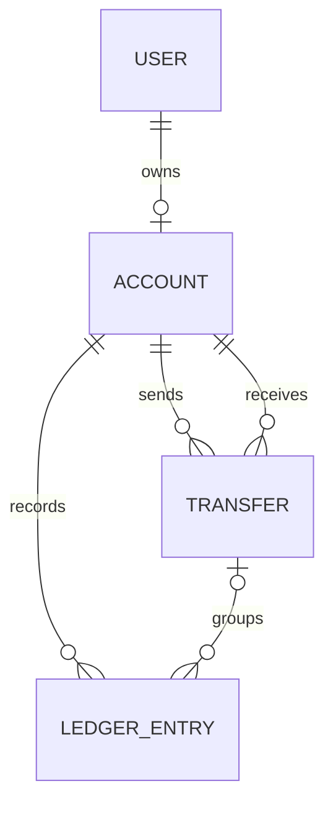

# AuditFlow Database Design

> Status: Draft — updated to reflect the current Prisma schema and registration implementation.

## Database technology

- Database: PostgreSQL
- ORM: Prisma
- Primary identifiers: UUID
- Money representation: integer cents
- Timestamp representation: timezone-aware UTC timestamps
- Naming convention: Prisma model names use singular PascalCase names

## Core design decisions

- Each user can currently own at most one account.
- Registration creates the user, account, and initial ledger entry atomically.
- Every account begins with a balance of `50000` cents.
- Every account number is a unique 12-digit string.
- Account balances are stored directly on the account.
- Ledger entries provide the history explaining balance changes.
- Transfers use an idempotency key to prevent duplicate processing.
- Version one uses one implicit currency and does not perform currency conversion.

## Entity relationships

---

# User

Represents a registered AuditFlow user.

| Column         | Database type  | Constraints                        | Description                |
| -------------- | -------------- | ---------------------------------- | -------------------------- |
| `id`           | UUID           | Primary key, generated             | Unique user identifier     |
| `email`        | Text           | Required, unique                   | Normalized lowercase email |
| `passwordHash` | Text           | Required                           | bcrypt password hash       |
| `firstName`    | Text           | Required                           | User’s first name          |
| `lastName`     | Text           | Required                           | User’s last name           |
| `createdAt`    | TIMESTAMPTZ(3) | Required, defaults to current time | Creation timestamp         |

## Relationships

- A user can have zero or one account at the database level.
- Normal application registration creates exactly one account.
- The one-account limit is enforced by the unique constraint on `Account.ownerId`.

## Security rules

- Plain-text passwords are never stored.
- Password hashes are never returned by the API.
- Email uniqueness is enforced by the database to prevent race conditions.

---

# Account

Represents the account owned by a user.

| Column          | Database type  | Constraints                        | Description                              |
| --------------- | -------------- | ---------------------------------- | ---------------------------------------- |
| `id`            | UUID           | Primary key, generated             | Unique account identifier                |
| `accountNumber` | Text           | Required, unique                   | Server-generated 12-digit account number |
| `ownerId`       | UUID           | Required, unique, foreign key      | References `User.id`                     |
| `balanceCents`  | Integer        | Required, defaults to `50000`      | Current account balance in cents         |
| `createdAt`     | TIMESTAMPTZ(3) | Required, defaults to current time | Creation timestamp                       |

## Relationships

- Each account belongs to exactly one user.
- Each user can own at most one account.
- An account can send many transfers.
- An account can receive many transfers.
- An account can have many ledger entries.

## Account-number generation

Account numbers:

- Contain exactly 12 digits.
- Are generated by the server.
- Are protected by a database unique constraint.
- Are regenerated when an account-number collision occurs.
- Are retried up to three times during registration.

## Balance rules

- New accounts begin with `50000` cents.
- `balanceCents` represents the current materialized balance.
- Balance changes must also create matching ledger entries.
- Transfer operations must not allow the source balance to become negative.
- Balance updates and ledger entries must be written in one transaction.

---

# Transfer

Represents money moved between two AuditFlow accounts.

| Column                 | Database type  | Constraints                        | Description                            |
| ---------------------- | -------------- | ---------------------------------- | -------------------------------------- |
| `id`                   | UUID           | Primary key, generated             | Unique transfer identifier             |
| `sourceAccountId`      | UUID           | Required, foreign key, indexed     | References the sending `Account.id`    |
| `destinationAccountId` | UUID           | Required, foreign key, indexed     | References the receiving `Account.id`  |
| `amountCents`          | Integer        | Required                           | Amount transferred in cents            |
| `idempotencyKey`       | Text           | Required, unique                   | Prevents duplicate transfer processing |
| `createdAt`            | TIMESTAMPTZ(3) | Required, defaults to current time | Transfer creation timestamp            |

## Relationships

- Every transfer has one source account.
- Every transfer has one destination account.
- A transfer can be associated with multiple ledger entries.

## Application-level rules

The application must enforce that:

- `amountCents` is a positive integer.
- The source and destination accounts are different.
- The source account belongs to the authenticated user.
- The source account has sufficient funds.
- Repeating the same idempotency key does not move money twice.
- Reusing an idempotency key with different request data is rejected.

---

# LedgerEntry

Represents one balance change applied to an account.

| Column        | Database type  | Constraints                        | Description                     |
| ------------- | -------------- | ---------------------------------- | ------------------------------- |
| `id`          | UUID           | Primary key, generated             | Unique ledger-entry identifier  |
| `accountId`   | UUID           | Required, foreign key, indexed     | References `Account.id`         |
| `transferId`  | UUID           | Nullable, foreign key              | References `Transfer.id`        |
| `amountCents` | Integer        | Required                           | Signed balance change in cents  |
| `createdAt`   | TIMESTAMPTZ(3) | Required, defaults to current time | Ledger-entry creation timestamp |

## Ledger amount convention

- Positive values increase an account’s balance.
- Negative values decrease an account’s balance.

Examples:

| Operation                 | Ledger amount |
| ------------------------- | ------------: |
| Initial account balance   |       `50000` |
| Receive a transfer of $25 |        `2500` |
| Send a transfer of $25    |       `-2500` |

## Initial ledger entry

Registration creates one initial ledger entry:

- `accountId` references the newly created account.
- `transferId` is `null`.
- `amountCents` is `50000`.

A null `transferId` indicates that the entry was not created by a transfer.

## Transfer ledger entries

A completed internal transfer creates two ledger entries:

1. A negative entry for the source account.
2. A positive entry for the destination account.

Both entries reference the same transfer.

---

# Transaction boundaries

## Registration transaction

The following operations occur in one transaction:

1. Create the user.
2. Create the account.
3. Create the initial ledger entry.

If any operation fails, all three operations are rolled back.

## Transfer transaction

The following operations must occur in one transaction:

1. Validate and create the transfer.
2. Decrease the source account balance.
3. Increase the destination account balance.
4. Create the source ledger entry.
5. Create the destination ledger entry.

If any operation fails, the complete transfer is rolled back.

---

# Constraints and indexes

## Unique constraints

- `User.email`
- `Account.accountNumber`
- `Account.ownerId`
- `Transfer.idempotencyKey`

## Foreign keys

- `Account.ownerId` → `User.id`
- `Transfer.sourceAccountId` → `Account.id`
- `Transfer.destinationAccountId` → `Account.id`
- `LedgerEntry.accountId` → `Account.id`
- `LedgerEntry.transferId` → `Transfer.id`

## Query indexes

- `Transfer.sourceAccountId`
- `Transfer.destinationAccountId`
- `LedgerEntry.accountId`

The unique constraint on `Account.ownerId` already creates an index that supports owner-based account lookups.

---

# Consistency invariants

The application must preserve these conditions:

- Each user owns at most one account.
- Account numbers are unique.
- Email addresses are unique.
- Transfer idempotency keys are unique.
- Transfer amounts are positive.
- Source and destination accounts are different.
- Account balances do not become negative.
- Every balance change has a corresponding ledger entry.
- The sum of an account’s ledger entries equals its current balance.
- Transfer balance changes and ledger entries are committed atomically.

---

# Future database additions

The following fields and models may be added later:

- Account type
- Account currency
- Account status
- Transfer status
- Transfer completion timestamp
- Refresh tokens
- Password-reset tokens
- Administrative alerts
- External bank-transfer information
